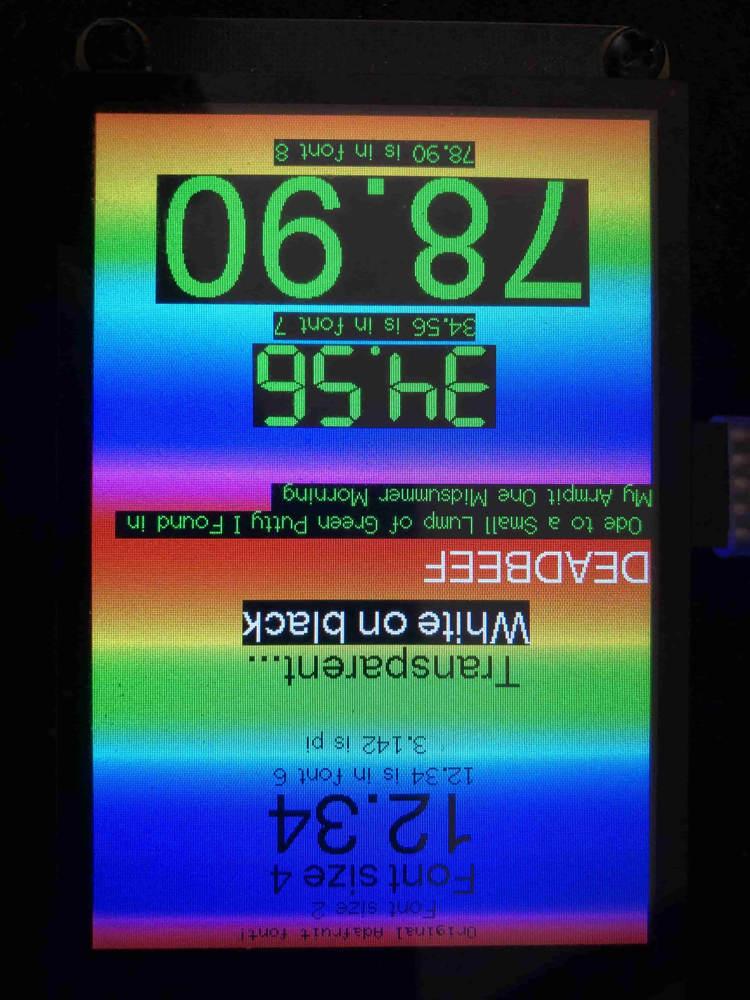
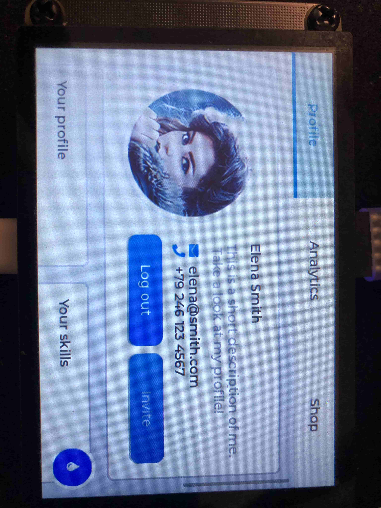

### Pico_DM_QD3503728 的 Arduino 移植

[[中文]](README.md)[[English]](README.en.md)

- 显示基于 TFT_eSPI 开发
    

### TODO

- [ ] 重写FT6236驱动，使其支持旋转
- [ ] 如何在 Arduino 中超频 RP2040，是否会影响其他库？
- [ ] 将这篇文档上传到Github Page

### 所需硬件

- Raspberry Pi Pico (with BOOTSEL button)
- 一根 Type-C USB 或 Micro-USB 线缆

### 在你开始之前

0. 通过git或者下载zip来获取本工程

    ```bash
    git clone https://github.com/embeddedboys/pico_dm_qd3503728_arduino.git
    ```

1. 在 Arduino IDE 中安装 pico 开发板

    > Referenced from [https://github.com/earlephilhower/arduino-pico](https://github.com/earlephilhower/arduino-pico)

    Open up the Arduino IDE and go to File->Preferences.

    In the dialog that pops up, enter the following URL in the "Additional Boards Manager URLs" field:

    https://github.com/earlephilhower/arduino-pico/releases/download/global/package_rp2040_index.json

    

    Hit OK to close the dialog.

    Go to Tools->Boards->Board Manager in the IDE

    Type "pico" in the search box and select "Add":

    

2. 通过 Arduino IDE 安装 lvgl 和 TFT_eSPI 库

    - TFT_eSPI
    - lvgl (version == 8.4.0)

3. 将 `TFT_eSPI/User_Setup.h` 替换成本工程中提供的

```bash
cd pico_dm_qd3503728_arduino
cp User_Setup.h ~/Arduino/libraries/TFT_eSPI/
```

4. 将 `lv_conf.h` 拷贝至 `Arduino/libraries` 目录下

```bash
cd pico_dm_qd3503728_arduino
cp lv_conf.h ~/Arduino/libraries/
```

5. 如果你想要构建 lvgl 的 demos, 将 `lvgl/demos`
目录拷贝至 `lvgl/src` 目录下， examples 也一样

```bash
cd ~/Arduino/libraries/lvgl
cp demos/ -r src/
cp examples -r src/
```

这时 `Arduino` 目录看起来是这样的：

    ```bash
    libraries\
        lvgl\
        TFT_eSPI\
            User_Setup.h
        lv_conf.h
    ```

> (`Arduino`目录在 Windows 上通常默认位于 `C\Users\your_username\Documents\Arduino` , 在 linux 上通常位于`~/Arduino`)

6. 在`Arduino IDE`中, 找到 `File->Open` 并且打开本工程中的 `main/main.ino` 文件

7. 上传工程到 Pico

    当你第一次上传工程时，你需要按下 Pico 的 BOOTSEL 按钮，然后插入你的电脑。此外，在你修改了工程后，你可以直接上传到你的 Pico 上。

    每次上传工程时，建议选择正确的 COM 端口。

8. Enjoy

    
