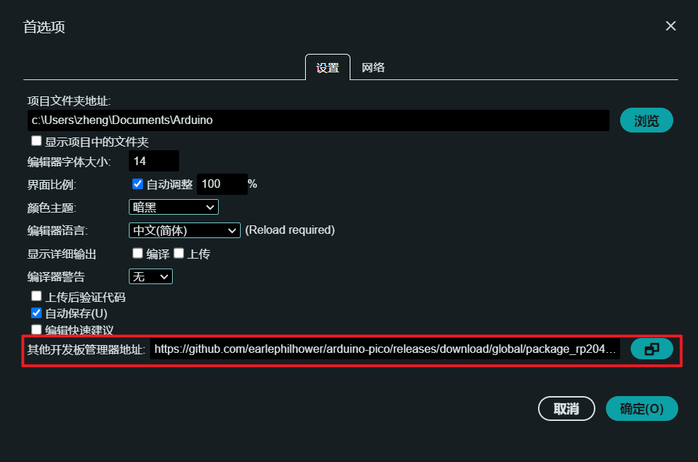
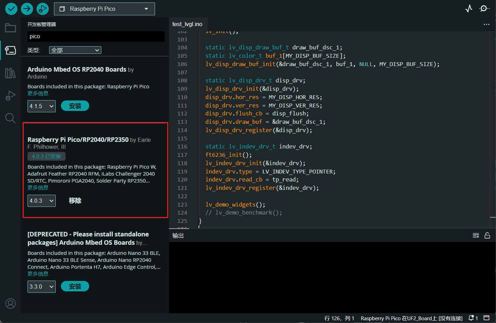

### Arduino Porting For Pico_DM_QD3503728

display is based on TFT_eSPI
touch

### TODO

- [ ] refactor the ft6236u driver, make it support rotation.
- [ ] How to overclock the pico in arduio? does it effect the other libraries?
- [ ] upload this document to the github page
- [ ] add chinese translation

### Hardware Prequisites

- Raspberry Pi Pico (with BOOTSEL button)
- A Type-C USB cable

### Before you start

0. Get this repository via git clone or download the zip file

    ```bash
    git clone https://github.com/embeddedboys/pico_dm_qd3503728_arduino.git
    ```

1. Install pico board support in Arduino IDE

    > Referenced from [https://github.com/earlephilhower/arduino-pico](https://github.com/earlephilhower/arduino-pico)

    Open up the Arduino IDE and go to File->Preferences.

    In the dialog that pops up, enter the following URL in the "Additional Boards Manager URLs" field:

    https://github.com/earlephilhower/arduino-pico/releases/download/global/package_rp2040_index.json

    

    Hit OK to close the dialog.

    Go to Tools->Boards->Board Manager in the IDE

    Type "pico" in the search box and select "Add":

    

2. Install these libraries via lib manager

    - TFT_eSPI
    - lvgl

3. Replace the `TFT_eSPI/User_Setup.h` with the one provided by this repository

4. Copy the `lv_conf.h` under the `libraries` directory


5. The `Arduino` folder should be like this:

    ```bash
    ├── libraries                                                                                                                                                                            │   ├── TFT_eSPI                                                                                                        │   ├── lv_conf.h                                                                                                       │   └── lvgl
    ```

    > (The `Arduino` folder usually at `C\Users\your_username\Documents\Arduino` on windows or `~/Documents/Arduino` on linux)

6. In `Arduino IDE`, go to `File->Open` and open `main.ino` which in this repository

7. Upload the sketch to your pico

    When the first time you upload the sketch, you need to press the BOOTSEL button on the pico then plug it to your computer. Otherwise, after you modified the sketch, you can just upload it to your pico.

    Each time you upload the sketch, select the correct COM port is suggested.

8. Enjoy
